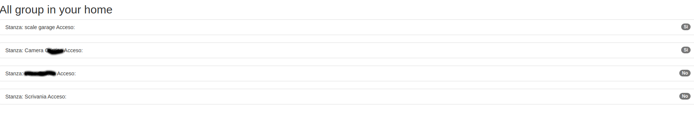
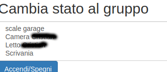
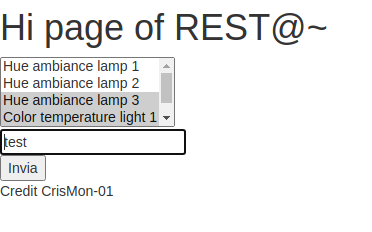

# REST@~

This webapp use the Philips HUE REST API. <br>
You can manage your lights with the browser only (for guests or without the mobile app). <br>
In a web page you can see the groups (the same as the mobile app). I remove the groups from the routine (the `Group for x` ).
In another page you can create group with a multiple selection box (you need to select your lights and add a name to the group)
The principal page is made up of three part:
* The first list the group and the actual state
* The second allow you to change the current state of the lights in a group 
* A link to a page to create new group
## example
* In the main page


* In the other page (/creategroup : creategroup.html) <br>

## Configure
You need to write a config file before start using it.
The file is used in the `app.py` in read only, so write a `config.yaml` in the main folder of the project.<br>
In the config.yaml you need
* IP of the Philips hue gateway 
* Access Token 
* Server Port to expose the page (I will remote it...)
example of config.yaml:
```
bridgeip: x.y.z.
authuser: xxxx-yyyy-zzzzzz
serverport: n
```
The information about the bridge IP and the token is in the official [Philips HUE SDK page](https://developers.meethue.com/develop/get-started-2/): 

## Run
`python3 app.py`

### P.S.
I made this only for fun. <br>